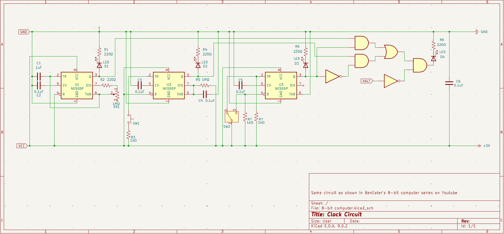

# 8-bit-computer
8-bit computer made on breadboard with IC chips

## 📐 Module: Clock

---

### 🖼️ Schematic Preview

 

---

### 🔧 Materials

| Qty | Component         | Part Number     | Notes |
|-----|-------------------|-----------------|-------|
| 3   | 555 Timer | NE555P | |
| 1   | NOT Gate | 74LS04 | Optional, Can be replaced with 2 NPN transistors and 4 10kΩ resistors |
| 1   | AND Gate | 74LS08 | Optional, Can be replaced with 6 NPN transistors and 9 10kΩ resistors |
| 1   | OR Gate | 74LS32 | Optional, Can be replaced with 2 NPN transistors and 3 10kΩ resistors |
| 5   | LED (Any color) | LED | |
| 4   | 220Ω Resistor | 220Ω Resistor | |
| 5   | 1KΩ Resistor | 1KΩ Resistor | |
| 1   | 1MΩ Resistor | 1MΩ Resistor | |
| 5   | 0.1µF Capacitor | 0.1µF Capacitor | Optionally add 3 more a bypass capacitors on logic gate IC chips |
| 1   | 1µF Capacitor | 1µF Capacitor | |
| 1   | 1MΩ Potentiometer | 1MΩ Potentiometer | |
| 1   | Pushbutton Switch | Pushbutton Switch | |
| 1   | Slideswitch | Slideswitch | |
|A lot| Wires | | 

---

### ⚙️ Integration Notes

- To be connected

---

